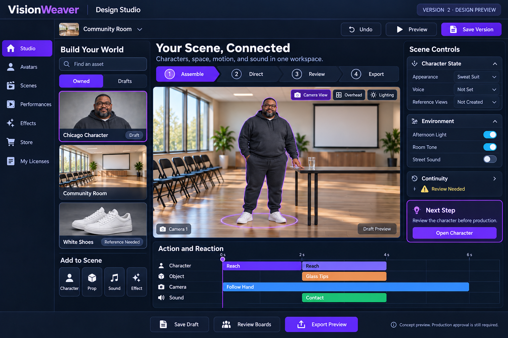
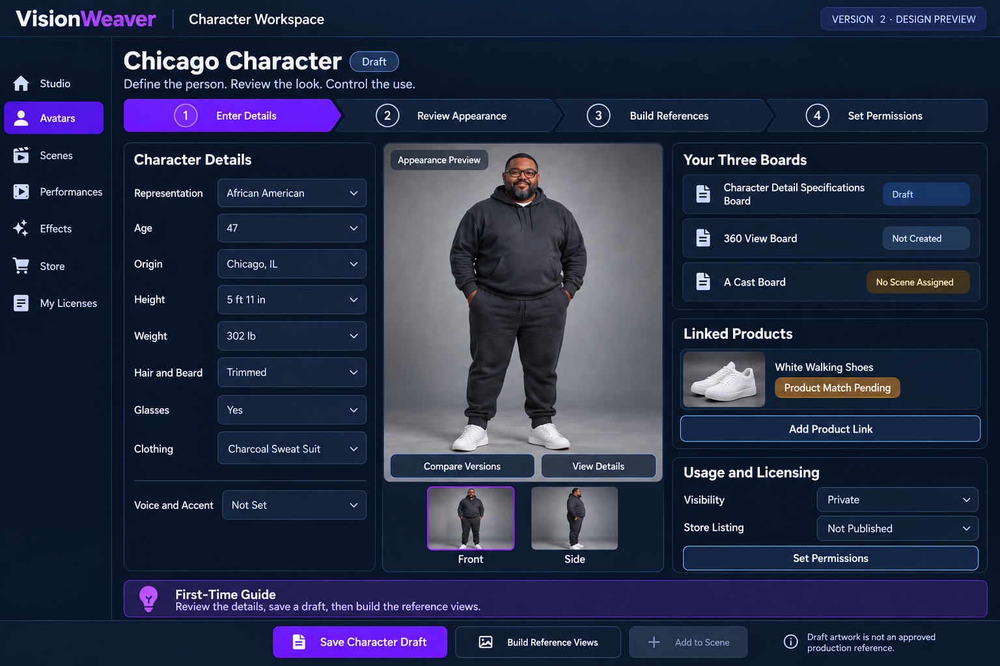

# VisionWeaver | Design Studio

A dedicated creation workspace for reusable digital performers, worlds, scenes, performances, effects, and eventually licensed marketplace assets. Created for **The Architect / Estiban Creations**. Canonical product name: **VisionWeaver | Design Studio**. Preserve the approved navy, charcoal, violet, and cyan design direction.

**Release: 0.2.02 — expanded connected authoring workspace, not a production rendering or commerce release.** The original V1 and richer V2 mockups are preserved unchanged below. Existing VisionWeaver production and its approved media are not replaced.

[Open Design Studio](https://visionweaver-design-studio.vercel.app/) — deployed authoring workspace. Cloud login and production execution remain unconfigured/locked. The current GitHub Quality Gate is blocked before execution by an account billing lock; see the verification record.

## Expanded release

Read the [page-by-page upgrade](docs/UPGRADE_0.2.02.md) and [current verification](docs/VERIFICATION_0.2.02.md). New tools include multi-scene cast blocking, linked wardrobe variants, voice direction, 16/24/32/64 reference planning, camera calibration, cue prerequisites, atmosphere layers, time-stretch calculations, field comparisons, complete draft import/export, private listing and rights records, a derived review queue, and proposed Creator / Studio / Enterprise tiers. No paid entitlements or automatic generation are activated.

## Start here

```bash
npm ci
npm test
npm run build
npm start
# Open http://localhost:4173
```

Node.js 22 or later is required. No credentials are needed for local draft editing. For cloud mode, copy `.env.example` to `.env`, configure the values privately, then use `node --env-file=.env server/index.mjs`. The plain `npm start` command reads environment variables supplied by your host; it does not automatically load `.env`.

## What works now

- A responsive, US English Design Studio application with Studio, Avatars, Scenes, Performances, Effects, Review, Store, My Licenses, Connections, Design History, and Plans & Tiers pages.
- Character metadata entry, catalog search, new characters, saved draft revisions, restore-as-new-draft, and product links restricted to HTTPS.
- Scene selection, character placement in a real editable overhead diagram, action/reaction timing, camera direction, and light/sound intent controls.
- Browser-local persistence and JSON draft export; saved history retains the newest 30 complete local checkpoints, with a 20-step session undo stack.
- Supabase PKCE OAuth client code for configured identity providers; authenticated API calls validate tokens against Supabase Auth.
- Cloud workspace creation, private append-only project versions, and restore of saved project drafts.
- A small authenticated read-only JSON-RPC MCP endpoint: initialize, ping, tools/list, and tools/call for accessible workspaces and drafts. No automatic OAuth discovery or cross-client certification yet.
- Server checks for origin, body limits, request throttling, token identity, explicit request fields, and draft-only access. Supabase enforces ownership/membership independently through RLS.
- Live database foundation applied to VisionWeaver's existing `Master Dashboard` Supabase project, `yqealeekngxooyoemfba`, in new `ds_*` tables. No existing `vw_*` schema or records were changed.

## What is deliberately not represented as complete

There is no deployed 3D renderer, generated avatar reference set, speech engine, licensed motion pack, media upload service, safety classifier, store checkout, seller payout, public listing, paid lease, or universal provider adapter. Mockup artwork is labeled as a design reference. The scene viewport is a blocking diagram, not the pictured photographic room. Timed previews demonstrate event order; they do not simulate body motion, sound, or physics.

The provider registry records requested capabilities as **Planned**. Accounts, credentials, scopes, commercial terms, moderation compatibility, and verified receipts are required per provider. A feature in ChatGPT, Gemini, Claude, or Manus does not grant this application that platform's private integration rights.

OAuth provider-console configuration, deployment-specific environment variables and callback URLs, and an authenticated end-to-end browser run remain required before cloud login is certified. Browser editing works independently. Rendering, uploads, public publishing, listing, and checkout endpoints return locked status; there is no environment switch to skip these release gates.

## Design history and original images

The Architect first established the Avatar State and its three boards, then expanded the concept into an Avatar Catalog with product-linked wardrobe, then a dedicated Design page, reusable Sims, and a licensable storefront. Matrix loading programs and time manipulation supplied design metaphors for modular scenes and performances. The user requested clear first-time instructions and accurate US English text, then explicitly preserved V1 and requested a deeper V2. This repository records that progression rather than resetting it.

| Version | Page | Source asset |
|---|---|---|
| V1 | Avatar Catalog and first-character guide | [Original PNG](public/mockups/v1-avatar-catalog.png) |
| V1 | Scene Builder and first-scene guide | [Original PNG](public/mockups/v1-scene-builder.png) |
| V2 | Design Studio, event timing, and environment controls | [Original PNG](public/mockups/v2-design-studio.png) |
| V2 | Character Workspace, three boards, products, and permissions | [Original PNG](public/mockups/v2-character-workspace.png) |





These original generated images are concept artwork, not proof of working features or approved character identity. The functional app presents them under Design History and explicitly labels appearance references. Their source filenames, hashes, and provenance are in [the asset manifest](docs/ASSET_MANIFEST.json).

Full origin: [Origin and Requirements](docs/ORIGIN_AND_REQUIREMENTS.md). Full layout and production model: [Design System](docs/DESIGN_SYSTEM.md).

## Product structure

**Design Studio** is the authoring workspace. **Avatar Catalog** indexes reusable characters and versions. **Scene Builder** connects cast, environment, cameras, actions, and sound. **Store** is the intended reviewed public selection of assets; private drafts never become listings automatically.

1. Enter character specifications or import authorized sources in a future upload workflow.
2. Review the appearance and approve an exact identity revision.
3. Build the three reference boards with explicit coverage and missing cells.
4. Load an approved character state into a scene and configure the world, props, cameras, actions, reactions, and transitions.
5. Rehearse, review, render through a tested provider, and export with provenance.
6. Publish a reviewed listing or license the application only after the commercial release gates are met.

The current app completes draft metadata and blocking portions of this workflow. It does not silently promote them to approved assets.

## The three boards

- **Character Detail Specifications Board** — canonical identity, body, complexion, facial geometry, hair, beard, clothing, injuries, physical changes, voice, accent, provenance, and permissions.
- **360 View Board** — per-character camera references: 32-view master, 16-view wardrobe-only variant, historical/intermediate 24-view studies, and a 64-cell full profile after eight heights are calibrated. Preserve exact view lineage and approval status.
- **A Cast Board** — scene-specific character instances, pinned appearance/voice/performance, camera selection, state changes, and continuity in/out.

See [Avatar State specification](docs/avatar-state-board-specification-v1.1.md), [Avatar Catalog](docs/avatar-catalog-v1.md), [legacy board contract](docs/character-board-system-v1.md), [representation standard](docs/representation-and-place-time-v1.md), and [animation production standard](docs/children-animation-production-standard-v1.md). These are imported source snapshots; their historical source-gap statements remain contextual, not new runtime findings.

## First example character

African American man, age 47, originally from Chicago, Illinois; 5 ft 11 in; 302 lb; trimmed haircut and beard; glasses; sweat suit; white active shoes. The gray/charcoal suit and original fictional face are mockup design choices, not an approved real person's identity. Voice, accent, exact complexion, fit, and final references require review. Body size must not drift through slimming or genericization.

User-supplied product: [Poramea candidate](https://www.amazon.com/dp/B0BGLDDZ9N?ref=ppx_pop_mob_ap_share). The exact product variant and image remain unverified. Generic shoes in the mockups must not be sold as a verified match. Product links, digital-asset licenses, and affiliate commissions are separate records and rights.

## Standalone and VisionWeaver modes

This repository owns the standalone source. VisionWeaver has a **Design Studio page** and a generated embedded browser module sourced from this app. The integration uses a sandboxed iframe containing the same JavaScript/CSS build; original concept images use commit-pinned GitHub URLs; its local editor runs without depending on an external deployment. The integration disables cloud operations inside the embedded module until a deployment-specific handoff is configured. The standalone Node service provides the cloud API and MCP surface.

Use `npm run build` followed by `node scripts/embed.mjs <visionweaver-checkout>` to refresh the embedded page. Record the Design Studio source revision in the integration docs. VisionWeaver remains the production orchestrator; this package owns the shared design module. Do not manually maintain divergent copies.

## Data and authentication

| Table | Purpose | Client access |
|---|---|---|
| `ds_workspaces` | Tenant-owned design spaces | Owner creates; owner/members read |
| `ds_memberships` | Service-managed viewer/editor/admin membership | User reads own membership; cannot promote self |
| `ds_draft_versions` | Immutable draft metadata snapshots | Owner/editor/admin insert; tenant-scoped read |
| `ds_account_verifications` | Restricted age/access verification | User reads own result; service writes |
| `ds_entitlements` | Future lease/license receipts | Tenant reads; service writes |
| `ds_connector_accounts` | Provider scopes and secret references | Owner reads permitted metadata columns; service writes |
| `ds_safety_cases` | Restricted incident/retention metadata | Service only |
| `ds_audit_events` | Append-only draft creation audit | Tenant reads; trusted trigger inserts |

All eight tables enable RLS. Anonymous users and unregistered delegated OAuth clients are denied. The application never uses a service-role secret. `SUPABASE_PUBLISHABLE_KEY` is public configuration, not an authorization bypass. Membership and ownership, not user-editable metadata, determine permissions. The private audit trigger has a fixed empty search path and no public execution grant. See [database and access verification](docs/VERIFICATION.md).

## API and MCP

Read [API contract](docs/API.md). User bearer tokens are accepted; arbitrary API keys and personal access token issuance are not implemented. API/MCP does not bypass tenant isolation or safety gates. Outbound credentials belong in an encrypted secret manager referenced by ID, never in this public repository, draft documents, or the browser bundle.

## Safety and legal boundaries

Read [Safety and Legal Design](docs/SAFETY_AND_LEGAL.md). The requested child protections are platform rules, including no child nudity, child sexualization, exploitation, or prohibited unlawful child-performance requests. General lawful fiction is not automatically illegal merely because it depicts wrongdoing; ambiguous requests require policy/legal review. Adult/graphic-content policy is pending counsel and provider requirements; restricted execution remains disabled.

User accountability does not create blanket immunity for the operator. Disclosure uses lawful, authorized process, mandatory reporting where applicable, least-necessary responsive information, and restricted audit/retention controls. Do not promise either unrestricted disclosure or absolute secrecy. No reports or data disclosures were sent by this implementation.

## Commercial model and release gates

The intended product supports standalone SaaS leases, enterprise deployments, white-label arrangements subject to brand terms, and creator asset licensing. Pricing, revenue share, source-code licensing, tax, refunds, chargebacks, payout onboarding, and age verification remain decisions to finalize. The repository was created with an MIT license, which is preserved in [LICENSE](LICENSE). MIT permits commercial code reuse; hosted subscriptions, support, and separately licensed assets can still be sold. Exclusive proprietary software licensing would require an explicit licensing decision and cannot revoke rights already granted.

Paid launch requires authenticated tenant isolation tests, real age/rights/moderation workflows, counsel-reviewed terms/privacy/takedown operations, reviewed vendor permissions, connected billing receipts, quota/abuse enforcement, deployment proof, backups/restore verification, and accessibility/browser acceptance. See [commercialization plan](docs/COMMERCIALIZATION.md).

## Verification and CI

`npm test` covers authentication failure, origin denial, anonymous rejection, user-token forwarding, locked production routes, MCP tool allowlisting, forged-approval rejection, policy triage, invalid product URLs, and timing validation. `npm run build` bundles locally pinned dependencies. CI runs these checks on every push and pull request. Live RLS tests were performed in a rolled-back transaction; see [verification record](docs/VERIFICATION.md).

## Repository map

- `src/` — responsive interface, local draft model, PKCE OAuth client.
- `server/` — static service, authenticated API, read-only MCP, policy gates, provider registry.
- `supabase/migrations/` — database migration applied to the existing VisionWeaver project.
- `public/mockups/` — unchanged original V1 and V2 images.
- `docs/` — origin, requirements, specifications, safety, commercialization, verification.
- `tests/` — meaningful server, model, and safety tests.
- `scripts/` — standalone build and VisionWeaver embedded-module generator.


## Global Place + People Reference Catalog — October 4, 2026

The [Global Place + People Reference Catalog v1](docs/GLOBAL_PLACE_PEOPLE_REFERENCE_CATALOG-v1.md) expands Design Studio into a worldwide source-federation model for places, environments, population/crowd references, local activity, transport, weather, ambient sound and production-ready Location Packs.

It explicitly separates **discovery** from **reuse rights**. Public availability or attribution alone is not permission to scrape, train on, redistribute, or commercially reuse content. Every provider and asset is assigned a rights class before entering Stock, Avatar, Scene or model-training workflows. Open/licensed sources can feed reusable catalogs when their exact terms permit it; restricted travel, map, booking and social sources remain API/display/link/manual-reference only unless a separate agreement grants broader rights.

Runtime provider adapters, source-policy enforcement, automatic ingestion and geographic pack generation are not represented as deployed by this documentation update.
